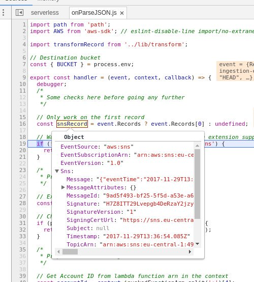

# Development tips and tricks

EUBFR makes heavy use of AWS cloud services and technologies. This is great for
reducing costs and utilizing modern tools and approaches for solving problems.

However, being able to develop with these services locally is not always the
most easy and straightforward task.

In this section of the documentation you will find hints on how to improve your
development workflows in a way that will make you work faster and easier with
the codebase locally.

## Developing an ETL service

EUBFR is a data lake project. ETLs are the plugins being used for transforming
producers' data from one format and structure to a [desired project model target][1].

Normally, when new producers are introduced in the system, they provide raw files
which serve as the base for building ETLs. Use these raw files for:

- Create a mapping document in the corresponding ETL's folder.
- Open a pull request to build a preview and reach an agreement about the mapping.
- Use this mapping agreement as a base for the development of the transform function.

Example: Imagine you receive a file `foo.csv` from `BAR` producer. In this case:

- Create the mapping document in `/services/ingestion/etl/bar/csv/README.md`
  You can find an example [here][2]
- Open a pull request, like [this][3]
- Use this mapping as described in the next section

### Developing a new ETL

Producers' raw data files vary in format and structure, but all of them should
reach a consistent structure and format. This stage is the "harmonization" stage.
Transform functions are functions which are called on each record/row of data
and output of the process is a new line delimited JSON file stored in harmonized
storage.

This is the conventional structure of an ETL:

```
.
└── csv
    ├── node_modules
    ├── package.json
    ├── README.md
    ├── serverless.yml
    ├── src
    │   ├── events
    │   │   └── onParseCSV.js
    │   └── lib
    │       ├── sns.js
    │       ├── transform.js
    │       └── uploadFromStream.js
    ├── test
    │   ├── stubs
    │   │   └── record.json
    │   └── unit
    │       ├── events
    │       │   └── onParseCSV.spec.js
    │       └── lib
    │           ├── __snapshots__
    │           │   └── transform.spec.js.snap
    │           └── transform.spec.js
    └── webpack.config.js
```

Here's a possible workflow which has proved efficient so far:

1.  Create the skeleton of the [serverless service][4]

It includes:

- serverless service manifest file: `serverless.yml` - defines cloud resources
  and glue between logic of the service
- AWS lambda function which gets triggered when a new file for the ETL comes
  in - in this case it's `./src/events/onParseCSV.js`. Without going into too
  many details here - you can take an example from another service matching the
  file format (extension) from another service. (CSV for example)
- Creating boilerplate assets: `test` folder, `webpack.config.js` file, etc. These
  you possibly already have taking the example service from the previous step.

2.  Grab an example record structure

- Deploy the service with `npx serverless deploy` ran inside the root of the service
- Trigger the function and `console.log` the incoming `event` parameter in order
  to generate stubs for event and record. These are later useful for local development.
  You might want to `JSON.strigify` objects for better readability in CloudWatch logs.

3.  Write a small transform function

- It's usually placed at `src/lib/transform.js`
- It should include the [flow][5] type for [Project][6]
- Include [JSDoc][7] comments to all helper functions in the transform in order
  to expose the smaller transformation steps in a user friendly [API pages][8]

4.  Write a test for the transform function

- It's usually placed at `test/unit/lib/transform.spec.js`
- Include assertions for matching snapshot

```js
test('Produces correct JSON output structure', () => {
  expect(result).toMatchSnapshot();
});
```

- Run [jest in watch mode][9] to iterate faster. Each time you edit the file with
  the transform function, the test runner will restart the test. You might want to
  use `console.log` to see results of your transform function while you develop it.

### Debugging a lambda function locally

As AWS lambda functions are also known as cloud functions, they are not always easy
to debug locally. However, making use of the serverless framework, we have some helpers
to do debugging locally.

1.  In `webpack.config.js`, set a new property if not already set `devtool: 'source-map'`.
    This will let you to see code for humans, not transpiled one during execution of code

2.  Add a breakpoint in with `debug;` either in lambda function or transform function

3.  Run the following in the CLI
    `node --inspect-brk ./node_modules/.bin/serverless invoke local -f fooFunction --path eventStub.json`

Where:

- `node --inspect-brk` is the Node.js core inspector protocol which opens a session to Chrome browser
- `serverless invoke local` is a specific command of the [serverless CLI][11]
- `fooFunction` is the name of the function as found in the `serverless.yml` file
- `eventStub` is the JSON file which you can take by using `console.log(JSON.strigify(event))`
  in the beginning of the lambda function

Open [Node.js debugger your Chrome browser's devtools][12]. You can also use the
REPL with core debugger as well.

As a result, you will be able step in and debug your cloud function locally with a decently
close emulation to the real environment.



**Note**

Because the lambda function of a given ETL depends on a file being present on S3 and
the transform function is meant to input this file and output another file with normalized
structure, do not remove the given S3 file during the debugging phase. This way, the
resource you want to test will be an actual file existing in the cloud and the lambda
function will operate quite closer to real life.

Another close resemblance to S3 read stream of files is to use the Node.js's core
[fs.createReadStream(path[, options])][13]. If you use this swapping approach you win
independence of AWS services, but you lose possible system-specific behaviors of
AWS SDK.

## Use TDD for faster iterations on custom features

Apart from using unit tests for faster development of ETLs, TDD can be also useful
for the faster development of any other type of custom logic which does not rely on
AWS functions.

In fact, we do sometimes mock AWS services, but these tests have far less value in
comparison to custom code which contain specific business logic and is more important
to be maintainable. AWS services are not only maintained by AWS, but they could also
change in time.

For an example, you can have a look at `@eubfr/ingestion-quality-analyzer` service.
Its use cases are described in the assertions and also they make it easy to iterate
faster on logic by again using the watch mode of jest and comparing the results of
various helper functions.

[1]: ./types/README.md
[2]: https://github.com/ec-europa/eubfr-data-lake/blob/master/services/ingestion/etl/just/csv/README.md
[3]: https://github.com/ec-europa/eubfr-data-lake/pull/102
[4]: https://serverless.com/
[5]: https://flow.org/
[6]: https://github.com/ec-europa/eubfr-data-lake/blob/docs/improve-developer-experience-EUBFR-106/services/ingestion/etl/_types/Project.js
[7]: http://usejsdoc.org/
[8]: https://ec-europa.github.io/eubfr-data-lake/
[9]: https://facebook.github.io/jest/docs/en/cli.html
[10]: https://nodejs.org/en/docs/guides/debugging-getting-started/
[11]: https://serverless.com/framework/docs/providers/aws/cli-reference/invoke-local/
[12]: https://medium.com/@paul_irish/debugging-node-js-nightlies-with-chrome-devtools-7c4a1b95ae27
[13]: https://nodejs.org/api/fs.html#fs_fs_createreadstream_path_options
