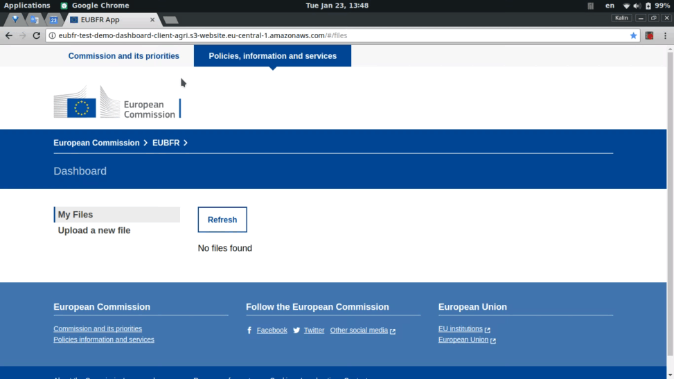
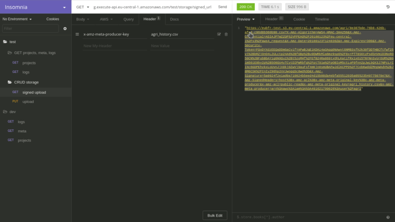
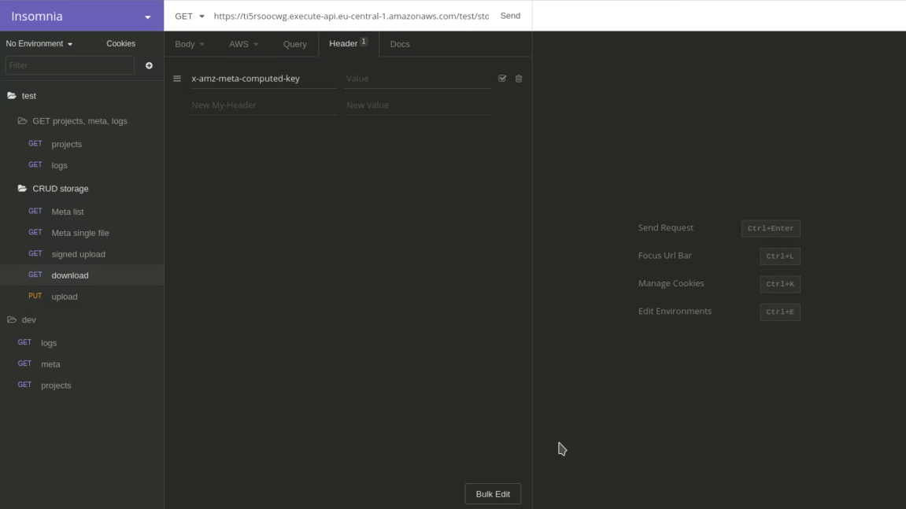

# Pushing information to EUBFR data lake

This is a high-level guide explaining the low-level approach of ingesting data programatically. Because the work will be done through the HTTP protocol via RESTful requests, you can either use the same tools as described here, or use any other custom script or tool that work with the protocol and is more convenient for you.

## Getting credentials

To receive AWS access key id and secret, please contact EUBFR PM. These credentials will be provided privately.

## Ingestion-related endpoints

The information necessary for managing the ingestion process for a producer is currently divided into 2 APIs:

* **Storage API**: managing the physical files used for the ingestion
* **Meta Index API**: managing the meta data for the physical files

Note that root endpoints change in time. Please request this information about a given stage and endpoint you need for your implementation. You will be notified each time there is a change in address.

### Storage API

All request headers should comply with the [signature version 4 signing process](https://docs.aws.amazon.com/general/latest/gr/signature-version-4.html) which gives producers a secured temporary access to AWS resources. On top of that, some methods require specific keys to know which specific information is to be managed.

Here's an example endpoint for `test` stage environment:

`API -> https://ti5rsoocwg.execute-api.eu-central-1.amazonaws.com/test/`

| #   | Operation             | Endpoint                   | Method | Headers on top of AWS signature |
| --- | --------------------- | -------------------------- | ------ | ------------------------------- |
| 1   | Get signed upload URL | {`API`}/storage/signed_url | GET    | `x-amz-meta-producer-key`       |
| 2   | Download              | {`API`}/storage/download   | GET    | `x-amz-meta-computed-key`       |
| 3   | Delete                | {`API`}/storage/delete     | GET    | `x-amz-meta-computed-key`       |

### Meta Index API

Here's an example endpoint for `test` stage environment:

`API -> https://search-test-meta-{domainId}.eu-central-1.es.amazonaws.com/`

This endpoint is based on [AWS (managed) Elasticsearch](https://docs.aws.amazon.com/elasticsearch-service/latest/developerguide/aes-supported-es-operations.html), so you can refer to [official API documentation](https://www.elastic.co/guide/en/elasticsearch/reference/current/docs.html) when working with this interface.

## Ingestion workflows

Below you can find a short overview on how to achieve CRUD operations while managing the ingestion for your projects.

### Uploading data

In order to upload new data, you will need to start with operation (1) which will provide you with a signed URL. This URL gives you temporary permissions to add new physical file to the AWS S3 bucket. The file formats supported so far are: `csv`, `json`, `xls` and `xml`.

Adding a physical file to a specific S3 bucket on AWS is the first stage of the ingestion process, the rest of the extraction, transformation and loading operations are automatically done in relation to the S3 bucket. The producer does not need to take any further actions than managing his data files.



When you get the signed URL, use the generated URL with `PUT`, attaching a file matching exactly the signed `x-amz-meta-producer-key`.



If you have missing or wrong header keys or if the request validity has expired, you will get a response with a warning as a status code and message describing the issue at hand. In case of success, the client will receive status code `200`.

### Getting information about existing data

When you plan to update existing information on the data lake, first you need to see what are the existing files. For this, use the meta index API.

Here's an example response:

```json
[
  {
    "metadata": {},
    "content_length": 259051,
    "producer_id": "agri",
    "original_key": "agri_history.csv",
    "content_type": "binary/octet-stream",
    "computed_key": "agri/8e387bde-76b8-426b-afe4-c96d8b360b90.csv",
    "status": "parsed",
    "message": "ETL successful",
    "last_modified": "2018-01-23T12:49:17.000Z"
  }
]
```

### Downloading file with existing data

When you need to update information regarding your projects, you are able to download the file holding the data which is present in the data lake. Correcting and re-uploading a file will update the information about your projects in the data lake. For downloading the file with existing data for corrections, use operation (2).



If you don't provide the correct header, you will get feedback in the response body. Double-check the information from the meta index when in doubt.

### Deleting data

When you would like to delete the file, and thus data related to it from the data lake, use operation (3).
