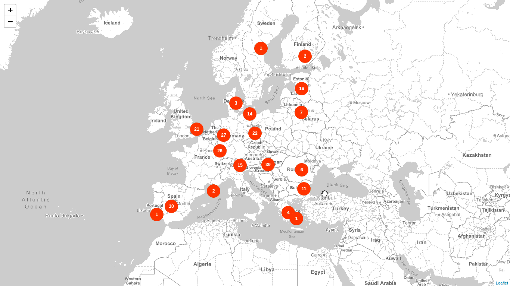

# Aggregate projects by location (Geo Centroid Aggregation)

This example shows how to aggregate projects by the `contry_code` field and then compute the `centroid` field in an attempt of doing a simple server side clustering. We make use of the _Geo Centroid Aggregation_

* Endpoint: `https://PROJECTS_INDEX/project/_search`
* Method: `POST`

## Request

```json
{
  "size": 0,
  "aggregations": {
    "locations": {
      "nested": {
        "path": "project_locations"
      },
      "aggregations": {
        "filtered": {
          "filter": {
            "geo_bounding_box": {
              "project_locations.centroid": {
                "top_left": {
                  "lat": 65.494,
                  "lon": -22.192
                },
                "bottom_right": {
                  "lat": 37.892,
                  "lon": 28.784
                }
              }
            }
          },
          "aggregations": {
            "countries": {
              "terms": {
                "size": 100,
                "field": "project_locations.country_code"
              },
              "aggregations": {
                "centroid": {
                  "geo_centroid": {
                    "field": "project_locations.centroid"
                  }
                },
                "info": {
                  "reverse_nested": {},
                  "aggregations": {
                    "place": {
                      "top_hits": {
                        "size": 1,
                        "sort": [
                          {
                            "last_modified": {
                              "order": "desc"
                            }
                          }
                        ],
                        "_source": {
                          "includes": ["title", "description"]
                        }
                      }
                    }
                  }
                }
              }
            }
          }
        }
      }
    }
  }
}
```

## Response

```json
{
  "aggregations": {
    "locations": {
      "doc_count": 195432,
      "filtered": {
        "doc_count": 90496,
        "countries": {
          "doc_count_error_upper_bound": 0,
          "sum_other_doc_count": 0,
          "buckets": [
            {
              "key": "ES",
              "doc_count": 10818,
              "centroid": {
                "location": {
                  "lat": 40.003254453612094,
                  "lon": -4.002229473282414
                },
                "count": 10818
              },
              "info": {
                "doc_count": 10732,
                "place": {
                  "hits": {
                    "total": 10732,
                    "max_score": null,
                    "hits": [
                      {
                        "_index": "test-projects",
                        "_type": "project",
                        "_id": "06949bcf046ffbb6420c08c23acccc8c",
                        "_score": null,
                        "_source": {
                          "description": "description",
                          "title": "Title"
                        },
                        "sort": [1519739025581]
                      }
                    ]
                  }
                }
              }
            }
          ]
        }
      }
    }
  }
}
```

## Result


