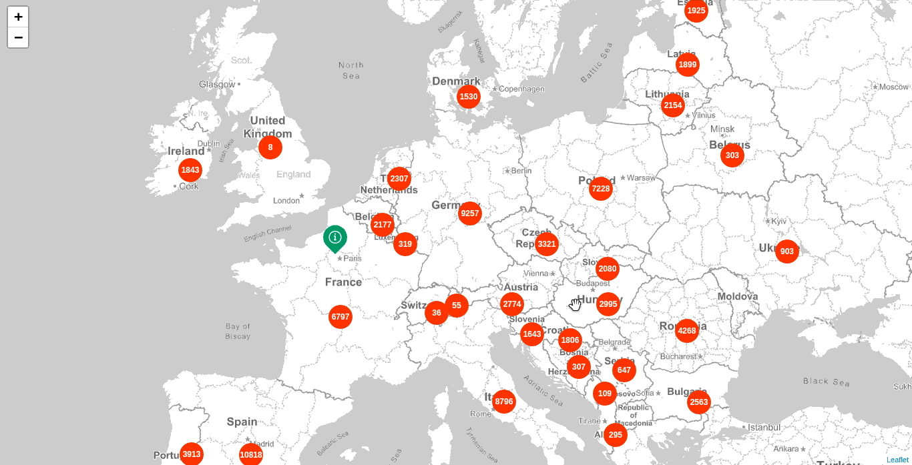

# Aggregate projects by location (Geo Centroid Aggregation)

This example shows how to aggregate projects by the `centroid` field in an attempt of doing a simple server side clustering. We make use of the _Geo Centroid Aggregation_

* Endpoint: `https://PROJECTS_INDEX/project/_search`
* Method: `POST`

## Request

```json
{
  "size": 0,
  "query": {
    "nested": {
      "path": "project_locations",
      "query": {
        "constant_score": {
          "filter": {
            "geo_bounding_box": {
              "project_locations.centroid": {
                "top_left": {
                  "lat": 65.494,
                  "lon": -22.192
                },
                "bottom_right": {
                  "lat": 37.892,
                  "lon": 28.784
                }
              }
            }
          }
        }
      }
    }
  },
  "aggregations": {
    "locations": {
      "nested": {
        "path": "project_locations"
      },
      "aggs": {
        "countries": {
          "terms": {
            "field": "project_locations.country_code"
          },
          "aggs": {
            "centroid": {
              "geo_centroid": {
                "field": "project_locations.centroid"
              }
            },
            "aggs": {
              "reverse_nested": {},
              "aggs": {
                "place": {
                  "top_hits": {
                    "size": 1,
                    "sort": [
                      {
                        "last_modified": {
                          "order": "desc"
                        }
                      }
                    ],
                    "_source": {
                      "includes": ["title", "description"]
                    }
                  }
                }
              }
            }
          }
        }
      }
    }
  }
}
```

## Response

```json
"aggregations": {
  "locations": {
    "doc_count": 10,
    "countries": {
      "doc_count_error_upper_bound": 0,
      "sum_other_doc_count": 0,
      "buckets": [{
        "key": "BE",
        "doc_count": 1,
        "centroid": {
          "location": {
            "lat": 40.400,
            "lon": 10.001
          },
          "count": 1
        },
        "aggs": {
          "doc_count": 1,
          "place": {
            "hits": {
              "total": 1,
              "max_score": null,
              "hits": [{
                "_index": "my_index_dev",
                "_type": "project",
                "_id": "ID",
                "_score": null,
                "_source": {
                  "description": "description",
                  "title": "Title"
                },
                "sort": [1518690764000]
              }]
            }
          }
        }
      }]
    }
  }
}
```

## Result


