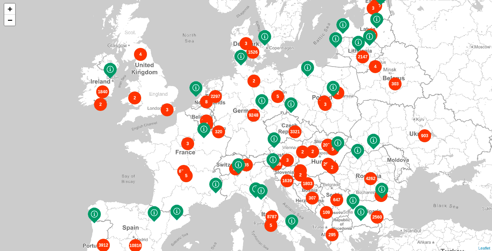

# Aggregate projects by location (Geohash Grid Aggregation)

This example shows how to aggregate projects by the `centroid` field in an attempt of doing a simple server side clustering. We make use of the _GeoHash grid Aggregation_ with a defined precision that goes from 1 to 12.

The returned buckets will contain geohashes and you will need a library to convert these into equivalent bounding boxes or points.

* Endpoint: `https://PROJECTS_INDEX/project/_search`
* Method: `POST`

## Request

```json
{
  size: 0,
  query: {
    nested: {
      path: "project_locations",
      query: {
        constant_score: {
          filter: {
            geo_bounding_box: {
              "project_locations.centroid": {
                top_left: {
                  lat: 65.494,
                  lon: -22.192
                },
                bottom_right: {
                  lat: 37.892,
                  lon: 28.784
                }
              }
            }
          }
        }
      }
    }
  },
  aggregations: {
    locations: {
      nested: {
        path: "project_locations"
      },
      aggs: {
        grid: {
          geohash_grid: {
            field: "project_locations.centroid",
            precision: 2
          }
        }
      }
    }
  }
}
```

## Response

```json
"aggregations": {
  "locations": {
    "doc_count": 161,
    "grid": {
      "buckets": [{
          "key": "u2",
          "doc_count": 39
      }, {
          "key": "u1",
          "doc_count": 21
      }, {
          "key": "u0",
          "doc_count": 19
      }]
    }
  }
}
```

## Result


