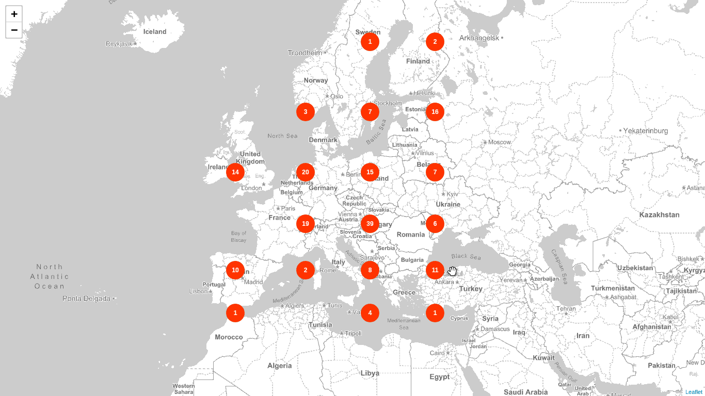

# Aggregate projects by location (server-side clustering)

This example shows how to aggregate projects by the `centroid` field in an attempt of doing server side clustering.
First example makes use of the _GeoHash grid Aggregation_ with a defined precision (from 1-12)
while the second example adds _Geo Centroid Aggregation_ as a second aggregation for a more realistic display of the markers.

* Endpoint: `https://PROJECTS_INDEX/project/_search`
* Method: `POST`

## Example: GeoHash grid Aggregation

### Request

```json
{
  "size": 0,
  "query": {
    "constant_score": {
      "filter": {
        "geo_bounding_box": {
          "project_locations.centroid": {
            "top_left": {
              "lat": 65.494,
              "lon": -22.192
            },
            "bottom_right": {
              "lat": 37.892,
              "lon": 28.784
            }
          }
        }
      }
    }
  },
  "aggregations": {
    "europe_grid": {
      "geohash_grid": {
        "field": "project_locations.centroid",
        "precision": 2
      }
    }
  }
}
```

### Response

```json
"aggregations": {
  "europe_grid": {
    "buckets": [
      {
        "key": "u2",
        "doc_count": 39
      },
      {
        "key": "u1",
        "doc_count": 20
      },
      {
        "key": "u0",
        "doc_count": 19
      }
  }
}
```

You need a library to convert the geohashes from `key` into bounding boxes or points.

### Result



## Example: GeoHash grid Aggregation

### Request

```json
{
  "size": 0,
  "query": {
    "constant_score": {
      "filter": {
        "geo_bounding_box": {
          "project_locations.centroid": {
            "top_left": {
              "lat": 65.494,
              "lon": -22.192
            },
            "bottom_right": {
              "lat": 37.892,
              "lon": 28.784
            }
          }
        }
      }
    }
  },
  "aggregations": {
    "europe_grid": {
      "geohash_grid": {
        "field": "project_locations.centroid",
        "precision": 2
      },
      "aggs": {
        "myCentroid": {
          "geo_centroid": {
            "field": "project_locations.centroid"
          }
        }
      }
    }
  }
}
```

### Response

```json
"aggregations": {
  "europe_grid": {
    "buckets": [
      {
        "key": "u2",
        "doc_count": 39,
        "myCentroid": {
          "location": {
            "lat": 47.36625675971691,
            "lon": 17.0201318560598
          },
          "count": 39
        }
      },
      {
        "key": "ud",
        "doc_count": 16,
        "myCentroid": {
          "location": {
            "lat": 58.12248645670479,
            "lon": 24.922883544350043
          },
          "count": 16
        }
      },
    ]
  }
```

### Result


