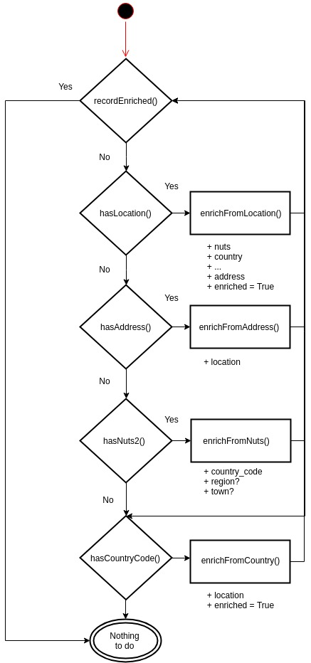

# Data enrichment

This page gives an overview of the existing workflows enriching information in the data lake from external services.

## Producers' data availability grid

This document is useful when you need to know the following:

* which producers provide which type of data
* which are the geolocation fields taken into account
* take a look at example data before ETL's transformations

## Location enrichment workflows

Draft diagram of the location data enrichment workflows, in descending precision.

